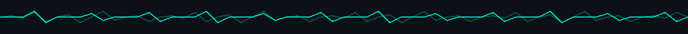

<!-- ===================== BANNER ===================== -->

  

  

  

  

---

<!-- ===================== About Me Section ===================== -->

  

<table style="border-collapse: collapse; font-family: 'Courier New', monospace; margin: 0 auto;">
  <tr style="background-color: #1a1a1a;">
    <td style="color: #33ff33; padding: 12px; font-size: 16px;">
      techypoetic@github:~$ I completed the <strong>Meta Programming in Python</strong> course on Coursera 🐍
    </td>
  </tr>
  <tr style="background-color: #2d2d2d;">
    <td style="color: #33ff33; padding: 12px; font-size: 16px;">
      techypoetic@github:~$ I'm graduating with a <strong>Diploma in Cloud Engineering</strong> from AltSchool in March 2026 ☁️
    </td>
  </tr>
  <tr style="background-color: #1a1a1a;">
    <td style="color: #33ff33; padding: 12px; font-size: 16px;">
      &nbsp;
    </td>
  </tr>
  <tr style="background-color: #2d2d2d;">
    <td style="color: #33ff33; padding: 12px; font-size: 16px;">
      techypoetic@github:~$ I am passionate about sharing my expertise and open to collaborating on/
    </td>
  </tr>
  <tr style="background-color: #1a1a1a;">
    <td style="color: #33ff33; padding: 12px; font-size: 16px;">
      techypoetic@github:~$ interesting ideas and meaningful projects.
    </td>
  </tr>
  <tr style="background-color: #2d2d2d;">
    <td style="color: #33ff33; padding: 12px; font-size: 16px;">
      &nbsp;
    </td>
  </tr>
  <tr style="background-color: #1a1a1a;">
    <td style="color: #33ff33; padding: 12px; font-size: 16px;">
      techypoetic@github:~$ Outside of tech, I enjoy reading, watching dramas, and writing/
    </td>
  </tr>
  <tr style="background-color: #2d2d2d;">
    <td style="color: #33ff33; padding: 12px; font-size: 16px;">
      techypoetic@github:~$ both creative pieces and technical content ✍️
    </td>
  </tr>
</table>

  
    

  

<table style="border-collapse: collapse; font-family: 'Courier New', monospace; margin: 0 auto;">
  <tr style="background-color: #1a1a1a;">
    <td style="color: #33ff33; padding: 12px; font-size: 16px;">
      techypoetic@github:~$ I'm just a click away 📡
    </td>
  </tr>
  <tr style="background-color: #2d2d2d;">
    <td style="color: #33ff33; padding: 12px; font-size: 16px;">
     techypoetic@github:~$ Feel free to reach out if you want to talk tech, collaboration,
    </td>
  </tr>
  <tr style="background-color: #1a1a1a;">
    <td style="color: #33ff33; padding: 12px; font-size: 16px;">
      techypoetic@github:~$ or explore ideas together.
    </td>
  </tr>
</table>

  

---

<!-- ===================== Contact Me section ===================== -->

  
    

 

  

<table style="border-collapse: collapse; font-family: 'Courier New', monospace; margin: 0 auto; border: 2px solid #33ff33; background-color: #000000;">
  <tr>
    <td style="color: #33ff33; padding: 20px; text-align: left; padding-left: 100px;">
     <strong>X (TWITTER)</strong> 
    ║ @Techy_poetic 
    ╚══> <a href="https://x.com/Techy_poetic" style="color: #33ff33; text-decoration: none;">[CONNECT]</a> 
 
     <strong>DISCORD</strong> 
    ║ Join the Server 
    ╚══> <a href="https://discord.gg/exf7PWS3" style="color: #33ff33; text-decoration: none;">[JOIN]</a> 
 
     <strong>TELEGRAM</strong> 
    ║ @Insydusjester 
    ╚══> <a href="http://t.me/Insydusjester" style="color: #33ff33; text-decoration: none;">[MESSAGE]</a> 
 
     <strong>INSTAGRAM</strong> 
    ║ @urhierefe 
    ╚══> <a href="https://www.instagram.com/urhierefe?igsh=MTU0Mm1yN2tuY2FhOQ==" style="color: #33ff33; text-decoration: none;">[FOLLOW]</a> 
    </td>
  </tr>
</table>

 

  

  
    

---

<!-- ===================== Skill Stack Section ===================== -->

  

  

---

<!-- ===================== Projects List (Still in DEV ) ===================== -->

  

<table style="border-collapse: collapse; font-family: 'Courier New', monospace; margin: 0 auto;">
  <tr style="background-color: #1a1a1a;">
    <td style="color: #33ff33; padding: 12px; font-size: 16px;">
      <b>techypoetic@github:~$</b> Expected completion January 20th
    </td>
  </tr>
  <tr style="background-color: #2d2d2d;">
    <td style="color: #33ff33; padding: 12px; font-size: 16px;">
      <b>techypoetic@github:~$</b> Expected Completion January 30th
    </td>
    <tr style="background-color: #1a1a1a;">
    <td style="color: #33ff33; padding: 12px; font-size: 16px;">
      <b>techypoetic@github:~$</b> More Expected in Febuary
    </td>

  </tr>
</table>

---

<!-- ===================== GitHub Stats ===================== -->

<!-- GitHub Stats -->

---

  

<!-- ===================== FOOTER ===================== -->

  

